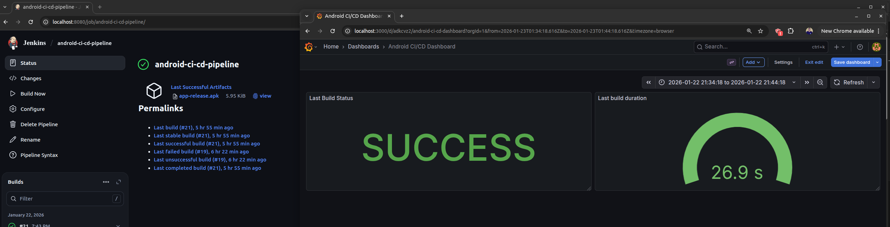

# Android CI/CD Pipeline with Jenkins, Firebase and Observability

This project demonstrates a complete **CI/CD pipeline for an Android application**, including:

- Automated build and signing of APKs
- Continuous Delivery using Firebase App Distribution
- Jenkins running in Docker with a custom image
- Full observability stack with Prometheus, Grafana and Loki
- Reproducible infrastructure using Docker Compose
- Cloud-agnostic architecture (ready for local or cloud deployment)

The goal of this project is to simulate a **real DevOps/SRE environment** for mobile applications.

---

## CI/CD Pipeline in Action



---

## Architecture Overview

- **CI Layer**: Jenkins (Docker)
- **Build**: Gradle Android build
- **Signing**: Keystore injected via Jenkins credentials
- **CD**: Firebase App Distribution
- **Observability**:
  - Prometheus → metrics
  - Grafana → dashboards
  - Loki + Promtail → centralized logs

CI and observability run in **separate Docker Composes**, connected through an external Docker network, making the setup **cloud-agnostic**.

---

## Android Local Setup (Optional)

You can build the APK locally before using Jenkins:

```bash
export KEYSTORE_FILE=$(pwd)/release.keystore
export KEYSTORE_PASSWORD=senha_do_keystore
export KEY_ALIAS=ciappkey
export KEY_PASSWORD=senha_da_key

./gradlew assembleRelease
```

This generates a signed APK:

```bash
app/build/outputs/apk/release/app-release.apk
```

## Jenkins Setup

### 1. Start Jenkins

```bash
cd jenkins
docker compose up -d
```

Jenkins will be available at:

```bash
http://localhost:8080
```

### 2. Install Required Plugins (Manual)

Inside Jenkins UI, install:

    - 2.1 Pipeline

    - 2.2 Git

    - 2.3 Docker Pipeline

    - 2.4 Credentials Binding

    - 2.5 Prometheus Metrics Plugin

### 3. Create the Pipeline Job

Create a Pipeline job manually:

    - Name: android-ci-cd-pipeline

    - Type: Pipeline

    - Definition: Pipeline script from SCM

    - SCM: Git

    - Repository URL: your GitHub repo

    - Script path: jenkins/Jenkinsfile

### 4. Jenkins Credentials

#### Jenkins Credentials Setup

This project requires several credentials to be configured in Jenkins.
They are used for APK signing and Firebase App Distribution.

Go to:

Jenkins → Manage Jenkins → Credentials → (Global) → Add Credentials

Create the following credentials:

| ID                       | Type        | Description                                          |
| ------------------------ | ----------- | ---------------------------------------------------- |
| android-keystore         | Secret file | Android `release.keystore` file used to sign the APK |
| keystore-password        | Secret text | Password of the keystore file                        |
| key-alias                | Secret text | Alias name of the key inside the keystore            |
| key-password             | Secret text | Password of the key alias                            |
| firebase-service-account | Secret file | Firebase service account JSON for authentication     |
| firebase-app-id          | Secret text | Firebase App ID used by Firebase App Distribution    |

These credentials are injected into the pipeline to securely handle **APK signing** and **Firebase authentication**, keeping all secrets out of the source code.

### 5. Firebase App Distribution

The pipeline includes a CD step that automatically uploads the APK to Firebase.

Steps:

    - Create a Firebase project

    - Register Android app

    - Enable App Distribution

    - Create a Service Account

    - Download JSON key

    - Store it in Jenkins credentials

The Jenkinsfile already contains:

```bash
    firebase appdistribution:distribute app/build/outputs/apk/release/app-release.apk
```

This allows internal testers to receive builds without Play Store.

### 6. Observability Stack

Start Observability

```bash
cd observability
docker compose up -d
```

Services:

    - Grafana → http://localhost:3000

    - Prometheus → http://localhost:9090

    - Loki → internal

    - Promtail → collects Jenkins logs

Dashboards as Code

All dashboards are provisioned via JSON + YAML:

    - grafana/dashboards/
    - grafana/datasources/

This guarantees:

    - No manual configuration

    - Fully reproducible environments

    - Ready for cloud deployment

Metrics and Logs:

Collected data:

    - Jenkins build status

    - Build duration

    - Last build result

    - Pipeline execution logs

    - Centralized logs via Loki

## Important Observability Note

Even with Grafana configured to refresh every 5 seconds and Prometheus using a low scrape interval, the final latency depends on the Jenkins Prometheus plugin.

The exporter works by polling Jenkins internal APIs and updating metrics periodically. Some metrics (like last build status) may take up to ~60 seconds to reflect after a build.

This is a known and expected behavior.

## Key Engineering Decisions

“The Jenkins generates a signed APK and automatically publishes it to Firebase App Distribution using a service account, allowing internal testing without Play Store.”

“I implemented full observability with metrics, centralized logs and dashboards to monitor builds, failures and duration.”

“The project is fully reproducible, with observability defined as code using Docker Compose, Prometheus, Grafana and Loki, enabling local or cloud deployment without vendor lock-in.”

“CI and observability are separated into different Docker Composes, connected by an external network and using Promtail for log collection, ensuring cloud-agnostic communication.”

“The pipeline is configured to automatically stop distribution if any previous stage fails, ensuring quality and traceability.”

“A custom Jenkins image was created to guarantee all build dependencies, avoiding missing commands and making the pipeline fully reproducible.”

## Cloud Deployment (Future)

This setup can be easily migrated to cloud:

    - Jenkins → EC2 / VM

    - Observability → EC2 / VM

    - Storage → EBS / disks

    - Networking → VPC / security groups

    - Infra as Code → Terraform
